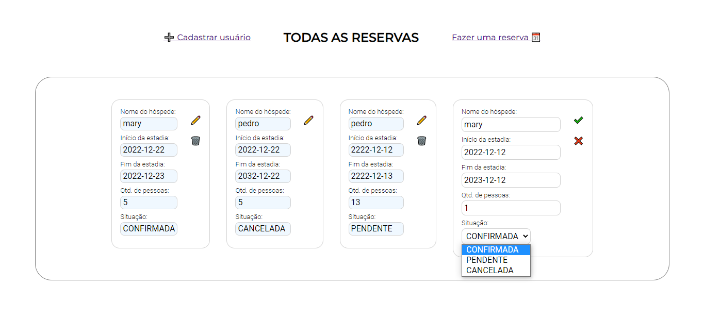
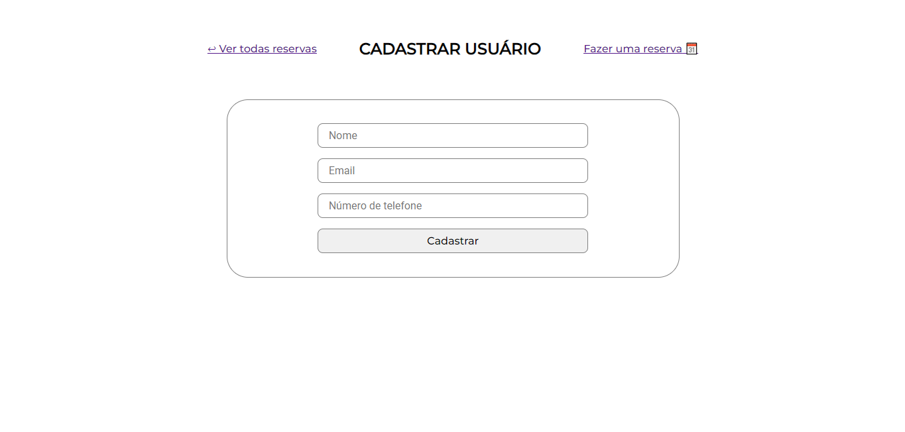
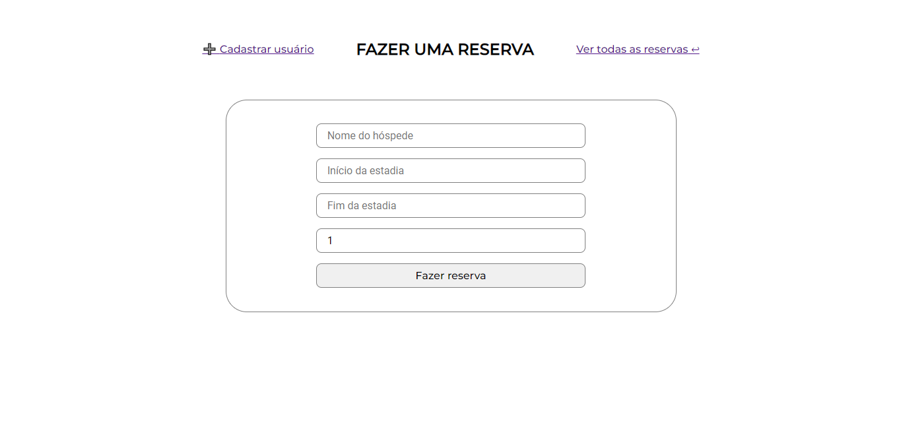

# Frontend da Aplicação de Reservas de Casa de Temporada (Angular)

Este repositório contém o frontend da aplicação de reservas de casa de temporada, desenvolvida em Angular. A aplicação interage com o backend Spring Boot para listar, criar, editar e cancelar reservas, bem como cadastrar novos usuários.

## Requisitos Técnicos

- Angular: Framework JavaScript utilizado para o desenvolvimento do frontend.
- HttpClient: Módulo do Angular para fazer requisições HTTP.
- Angular Router: Módulo para gerenciamento de rotas da aplicação.

## Configuração e Execução

1. Clone este repositório para sua máquina local.
2. Certifique-se de ter o Node.js e o Angular CLI instalados.
- **Node.js:** Caso não tenha o Node.js instalado, você pode baixá-lo e instalá-lo a partir do site oficial: [https://nodejs.org/](https://nodejs.org/)

- **Angular CLI:** Para instalar o Angular CLI globalmente, execute o seguinte comando no seu terminal:
     ```
     npm install -g @angular/cli
     ```
3. Navegue até a pasta do projeto frontend.
4. Instale as dependências com o comando:

```bash
npm install
```
5. Configure a URL base da API no arquivo `src/app/api.config.ts`.
6. Configure a URL base da API em `src/environments`.
7. Inicie o servidor de desenvolvimento com o comando:

```bash
npm start
```


## Páginas da Aplicação

### Página Inicial - Lista de Reservas

- Esta página exibe a lista de todas as reservas existentes.
- Cada reserva na lista pode ser editada ou cancelada.

### Página de Cadastro de Usuário

- Nesta página, é possível cadastrar um novo usuário.
- Campos necessários: nome, email e número de telefone.
- Para acessar esta página, vá para a rota `/cadastrar` ou clique no botão referente.

### Página de Cadastro de Reserva

- Nesta página, é possível criar uma nova reserva.
- Campos necessários: nome do hóspede, data de início, data de fim e quantidade de pessoas.
- Para acessar esta página, vá para a rota `/reservar` ou clique no botão referente.

## Observações

- Esse é um projeto inicial que deve ser aprimorado e  implementado com mais funções futuramente, como login e autenticação de usuário.
- **Importante:** Somente hóspedes cadastrados no sistema podem criar reservas.

## Capturas de Tela




